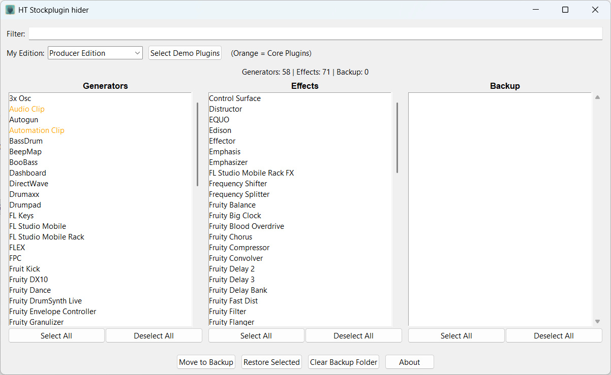

# HT Stockplugin Hider

A lightweight utility for FL Studio that lets you hide stock plugins from the plugin browser. This is especially useful for removing demo plugins that can't be disabled through FL Studio's built-in settings.

## The Problem

FL Studio displays all stock plugins in the UI, and does not allow hiding them through the Plugin Manager. Unlike third-party VSTs, stock plugins ignore the visibility toggle — they always show up, including demo-only plugins that are not part of your edition.

## The Solution

HT Stockplugin Hider moves the .fst and .nfo files of unwanted plugins out of the FL Studio Plugin Database folder into a backup location. FL Studio won't load what it can't find. Plugins can be restored at any time with a single click.

As a side effect, once the fst and nfo files of a stock plugin has been moved to backup, FL Studio recognizes it as a newly added plugin. Which means it can finally be toggled on and off through the Plugin Manager like any other plugin.

Note: No files are permanently deleted. And the plugins arent't touched at all. Plugins are only hidden by moving their database entries out of FL Studio's plugin folder. They can be restored at any time.

## Features

- Lists all installed FL Studio stock plugins, separated into Generators and Effects

- Select your FL Studio edition and automatically highlight all plugins that are demo-only

- Move plugins to a backup folder to hide them from FL Studio

- Restore plugins from the backup at any time

- Double-click a backup entry to restore it instantly

- Filter plugins by name

- Detects duplicate plugins on restore (e.g. after FL Studio reinstalls its plugin database)


## Supported Editions


- Fruity Edition

- Producer Edition

- Signature Bundle

- All Plugins Edition


## Requirements


- Windows 10 / 11

- A installed version of FL Studio (any version that uses the standard plugin database path)


## Installation


Download the latest release, unzip and run `HT_Stockplugin_Hider.exe`. No installation required.


## Backup Location


Plugins are moved to:

```

%APPDATA%\\HTstockpluginhiderBackup

```

Nothing is permanently deleted. You can always restore plugins from within the app or by manually copying files back. It is not necessary, since the Plugin manager can also add these files back by simply turning on these plugins. But is handy while editing the list.


## Usage


1. Launch the app

2. Select your FL Studio edition from the dropdown

3. Click \*\*Select Demo Plugins\*\* to automatically select all plugins not included in your edition

4. And / Or mark single plugins in the list that you want to hide

5. Click \*\*Move to Backup\*\* to hide them from FL Studio

6. Restart FL Studio


To restore plugins, select them in the Backup list and click \*\*Restore Selected\*\*, or simply double-click an entry.


## Screenshots




## License

MIT

